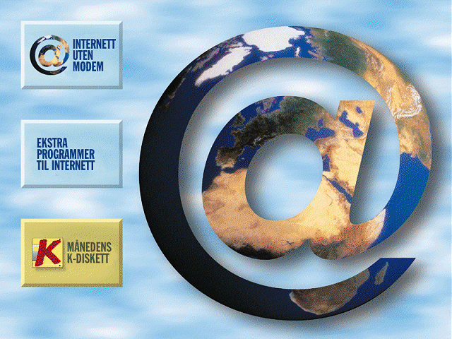

# Internett Uten Modem

[Komputer for alle](https://komputer.no/) er et datamagasin utgitt av Bonnier Publication International.  
For mange datainterreserte var det et stort høydepunkt hver gang et nytt magasin ble utgitt, hvor en fikk utforske medfølgende CD-rom for programvare og spill, shareware, freeware og demoer.
Det startet opp i 1997, og samme året ga de med en CD som inneholdt en rekke av nettsider, slik at det norske folk kunne få en smakebit på hvordan internett og nettsider så ut, da uten å måtte ha tilgang til et modem.

[Internett uten Modem](https://lanjelin.github.io/InternettUtenModem/WEB/INDEX.HTM) var navnet på denne CD'en, og nettsidene er lastet opp i sin helhet her.

Github-pages har litt trøbbel med [HTML 3.2](https://www.w3.org/TR/2018/SPSD-html32-20180315/), og en del av sidene vises dessverre ikke skikkelig, sidene er derfor også å finne [her](https://svan.es/1997/INDEX.HTM).
